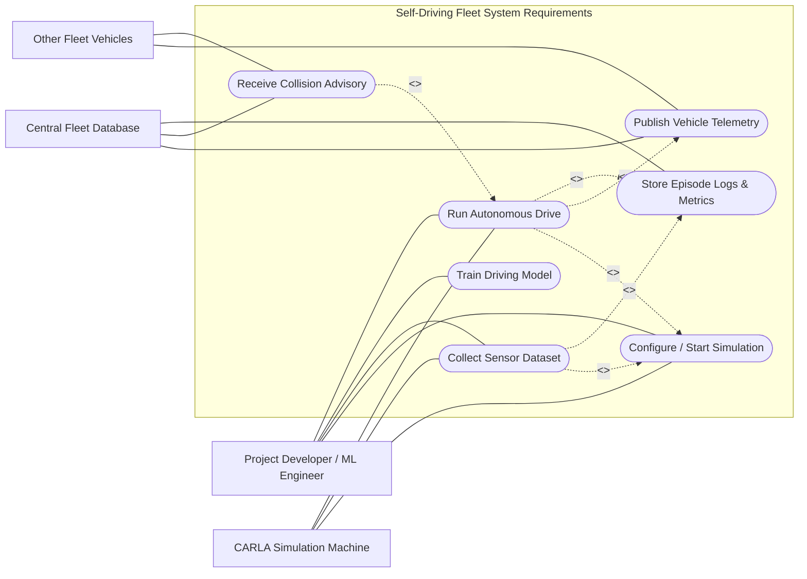
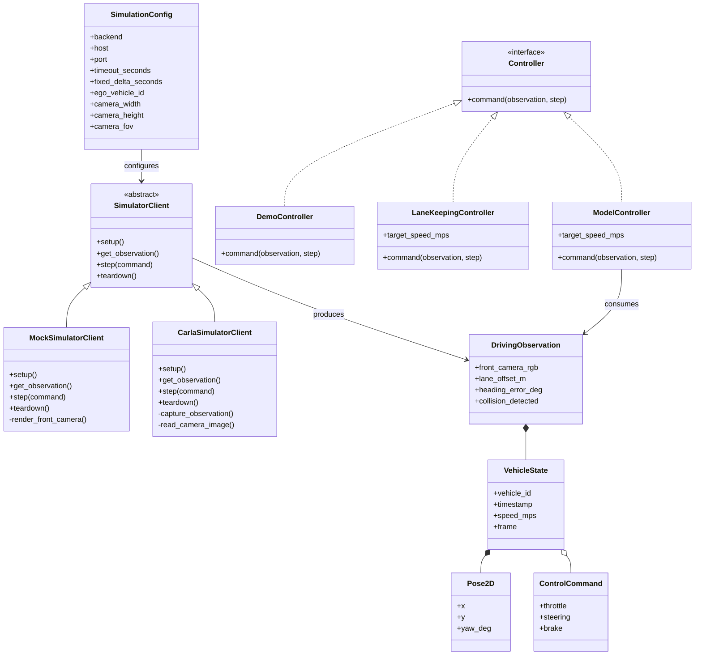
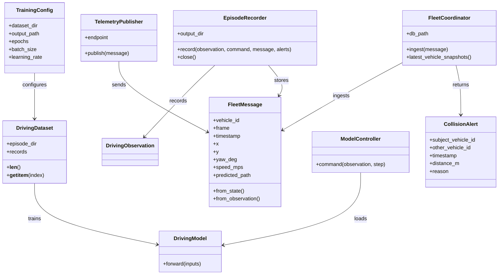
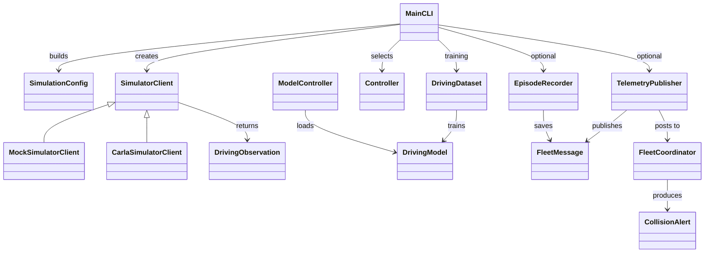

# Self-Driving Fleet System Specification and UML

Author: Dylan Weaver  
Last Update: 04/29/2026

## Table of Contents

1. Use Case Diagram
2. Class Diagrams and Class Descriptions
3. Static Relationship Diagram
4. Use Case Descriptions
5. Communication Diagrams and Operation Sequences

## 1. Use Case Diagram



## 2. Class Diagrams and Class Descriptions

### Core Runtime Class Diagram



### Data, Training, and Coordination Class Diagram



### Class Descriptions

`[SimulationConfig]`: The `SimulationConfig` class stores the runtime settings for a driving session. It defines which backend is used (`mock` or `carla`), which host and port to connect to, which ego vehicle is controlled, and what camera dimensions and timing parameters are active.

Attributes:
- `backend`
- `host`
- `port`
- `timeout_seconds`
- `fixed_delta_seconds`
- `ego_vehicle_id`
- `camera_width`
- `camera_height`
- `camera_fov`

Operations:
- configuration values are read by the CLI and simulator backends during startup

`[SimulatorClient]`: The `SimulatorClient` abstract class defines the shared interface between the local mock simulator and the real CARLA simulator. It ensures that the rest of the system can request observations and advance a control step without depending on one specific backend implementation.

Operations:
- `setup()`
- `get_observation()`
- `step(command)`
- `teardown()`

`[MockSimulatorClient]`: The `MockSimulatorClient` class provides a fake local simulator for macOS development. It synthesizes a road, vehicle motion, and a front camera image so the pipeline can be tested without CARLA.

Attributes:
- `_frame`
- `_timestamp`
- `_speed_mps`
- `_pose`
- `_last_command`

Operations:
- `setup()`
- `get_observation()`
- `step(command)`
- `_render_front_camera()`
- `teardown()`

`[CarlaSimulatorClient]`: The `CarlaSimulatorClient` class connects to the real CARLA server. It spawns the ego vehicle, attaches sensors, receives camera frames, detects collisions, and converts CARLA state into project observations.

Attributes:
- `_client`
- `_world`
- `_vehicle`
- `_camera`
- `_collision_sensor`
- `_image_queue`
- `_latest_collision_frame`

Operations:
- `setup()`
- `get_observation()`
- `step(command)`
- `_capture_observation()`
- `_read_camera_image()`
- `teardown()`

`[ControlCommand]`: The `ControlCommand` class stores the low-level actuation values sent to the vehicle. It represents throttle, steering, and brake for one control step.

Attributes:
- `throttle`
- `steering`
- `brake`

Operations:
- `as_dict()`

`[DrivingObservation]`: The `DrivingObservation` class represents what the controller sees at a given instant. It contains the front camera image, the current vehicle state, optional lane metrics, and a local collision flag.

Attributes:
- `state`
- `front_camera_rgb`
- `lane_offset_m`
- `heading_error_deg`
- `collision_detected`

`[VehicleState]`: The `VehicleState` class stores the ego vehicle’s measured state at a single frame. It contains pose, timestamp, speed, frame number, and the command associated with that step.

Attributes:
- `vehicle_id`
- `timestamp`
- `pose`
- `speed_mps`
- `control`
- `frame`

Operations:
- `as_dict()`

`[LaneKeepingController]`: The `LaneKeepingController` class is a rule-based controller used mainly for mock-mode dataset generation. It uses lane offset and heading error to produce a steering command and adjusts throttle to maintain a target speed.

Attributes:
- `target_speed_mps`

Operations:
- `command(observation, step)`

`[ModelController]`: The `ModelController` class wraps the trained neural network and uses it to generate closed-loop driving commands from camera observations. It loads a checkpoint, prepares the image tensor, runs inference, and clamps the outputs into valid vehicle commands.

Attributes:
- `model`
- `device`
- `metadata`
- `target_speed_mps`

Operations:
- `command(observation, step)`

`[EpisodeRecorder]`: The `EpisodeRecorder` class writes dataset episodes to disk. It stores images, a JSONL manifest, and run metadata so the same driving session can later be used for training and analysis.

Attributes:
- `output_dir`
- `images_dir`
- `manifest_path`
- `metadata_path`

Operations:
- `record(observation, command, message, alerts)`
- `close()`

`[DrivingDataset]`: The `DrivingDataset` class loads recorded episodes from disk for training. It parses the JSONL manifest, loads images, converts them to tensors, and returns control targets for the model.

Attributes:
- `episode_dir`
- `records`
- `image_shape`

Operations:
- `__len__()`
- `__getitem__(index)`

`[DrivingModel]`: The `DrivingModel` class is the core convolutional neural network used for behavior cloning. It takes front camera images as input and predicts throttle, steering, and brake values.

Operations:
- `forward(inputs)`

`[FleetMessage]`: The `FleetMessage` class represents the telemetry message sent by each vehicle to the central coordination service. It includes vehicle identity, current kinematics, and a short predicted path for coarse fleet-level collision checks.

Attributes:
- `vehicle_id`
- `frame`
- `timestamp`
- `x`
- `y`
- `yaw_deg`
- `speed_mps`
- `predicted_path`
- `confidence`

Operations:
- `from_state()`
- `from_observation()`
- `from_dict()`
- `as_dict()`

`[TelemetryPublisher]`: The `TelemetryPublisher` class sends `FleetMessage` payloads to the HTTP coordination service. It is intentionally non-blocking from a safety perspective; if publishing fails, the local driving loop continues.

Attributes:
- `endpoint`
- `timeout_seconds`

Operations:
- `publish(message)`

`[FleetCoordinator]`: The `FleetCoordinator` class is the server-side coordination component. It stores telemetry in SQLite, compares active vehicles, and produces collision alerts when proximity or predicted path overlap crosses a threshold.

Attributes:
- `db_path`
- `proximity_threshold_m`
- `stale_after_seconds`

Operations:
- `ingest(message)`
- `latest_vehicle_snapshots()`

## 3. Static Relationship Diagram



## 4. Use Case Descriptions

### Use Case: CONFIGURE / START SIMULATION

Pre-Conditions:
- The project files are available on the local machine or CARLA machine.
- The user has selected a valid backend: `mock` or `carla`.
- If `carla` is selected, the CARLA Python API and simulator server are available.

Dialog:

1. The developer starts the project with a CLI command.
   - `[main.py]:build_parser()`
2. The system parses the selected backend, vehicle ID, camera size, and runtime options.
   - `[main.py]:build_config()`
3. The system creates the simulator client.
   - `[main.py]:make_client()`
4. The system creates the selected controller.
   - `[main.py]:make_controller()`
5. The simulator backend initializes the session.
   - `[SimulatorClient]:setup()`
6. The runtime requests the first observation.
   - `[SimulatorClient]:get_observation()`
7. If the backend is unavailable, the session ends with a clear startup error.
   - `[CarlaSimulatorClient]:setup()`

Post-Conditions:
- A driving session is initialized and ready to step through observations.
- Or, if startup fails, the user receives a clean error without entering the loop.

Scenario Sequences:
- `1, 2, 3, 4, 5, 6` – Successful mock startup
- `1, 2, 3, 4, 5, 6` – Successful CARLA startup
- `1, 2, 3, 7` – CARLA API missing or simulator unavailable

### Use Case: COLLECT SENSOR DATASET

Pre-Conditions:
- The simulation can start successfully.
- The output episode directory is writable.
- A controller is selected to generate commands.

Dialog:

1. The developer runs the dataset collection command.
   - `[main.py]:handle_collect()`
2. The system chooses the controller for collection.
   - `[main.py]:make_controller()`
3. The system creates the episode recorder.
   - `[EpisodeRecorder]:__init__()`
4. The simulator produces the current observation.
   - `[SimulatorClient]:get_observation()`
5. The controller generates a low-level command.
   - `[LaneKeepingController]:command()` or `[DemoController]:command()`
6. The simulator advances one step.
   - `[SimulatorClient]:step(command)`
7. The system builds a fleet telemetry message for the current frame.
   - `[FleetMessage]:from_observation()`
8. The recorder saves the image, manifest row, and metadata.
   - `[EpisodeRecorder]:record()`
9. The system repeats the process until all steps are complete and then closes the recorder.
   - `[EpisodeRecorder]:close()`

Post-Conditions:
- A complete episode directory exists with images, manifest, and metadata.

Scenario Sequences:
- `1, 2, 3, 4, 5, 6, 7, 8, 9` – Successful collection
- `1, 2, 3, 4, 5, 6, 7` – Recording fails because output cannot be written

### Use Case: TRAIN DRIVING MODEL

Pre-Conditions:
- A recorded dataset exists with a valid `manifest.jsonl`.
- PyTorch is installed and available.

Dialog:

1. The developer starts model training.
   - `[main.py]:handle_train()`
2. The system loads the recorded dataset from disk.
   - `[DrivingDataset]:__init__()`
3. The dataset is split into training and validation subsets.
   - `[training.py]:split_dataset()`
4. The system initializes the neural network and optimizer.
   - `[DrivingModel]:forward(inputs)`
5. Each epoch trains the model on batches of image/control pairs.
   - `[training.py]:train_one_epoch()`
6. The system evaluates on the validation set when available.
   - `[training.py]:evaluate()`
7. The trained checkpoint is written to disk.
   - `[training.py]:train_model()`

Post-Conditions:
- A model checkpoint exists and can be loaded for inference.
- Training summary metrics are produced.

Scenario Sequences:
- `1, 2, 3, 4, 5, 6, 7` – Successful training
- `1, 2` – Dataset missing or manifest invalid

### Use Case: RUN AUTONOMOUS DRIVE

Pre-Conditions:
- A trained checkpoint exists.
- The selected simulator backend can start.

Dialog:

1. The developer starts an inference run.
   - `[main.py]:handle_drive()`
2. The system loads the trained checkpoint.
   - `[ModelController]:__init__()`
3. The simulator initializes and provides the first observation.
   - `[SimulatorClient]:setup()`
   - `[SimulatorClient]:get_observation()`
4. The model predicts a control command from the camera image.
   - `[ModelController]:command()`
5. The simulator advances one step using the predicted command.
   - `[SimulatorClient]:step(command)`
6. The system publishes telemetry if a coordinator URL is configured.
   - `[TelemetryPublisher]:publish(message)`
7. Any returned alerts are stored with the run output.
   - `[EpisodeRecorder]:record()`
8. The loop repeats until the configured number of steps is reached.

Post-Conditions:
- The autonomous run is completed and summarized.
- Optional recordings and telemetry logs are stored.

Scenario Sequences:
- `1, 2, 3, 4, 5, 6, 7, 8` – Successful autonomous run
- `1, 2` – Checkpoint missing or invalid
- `1, 2, 3, 4, 5, 6` – Coordinator unavailable; vehicle continues locally

### Use Case: COORDINATE FLEET TELEMETRY AND COLLISION ADVISORY

Pre-Conditions:
- The central coordination service is running.
- One or more vehicle clients are configured with a publish URL.

Dialog:

1. A vehicle client creates a telemetry message for the current frame.
   - `[FleetMessage]:from_observation()`
2. The telemetry publisher sends the message to the coordination server.
   - `[TelemetryPublisher]:publish(message)`
3. The server parses the HTTP payload.
   - `[TelemetryRequestHandler]:do_POST()`
4. The coordinator stores the telemetry row in SQLite.
   - `[FleetCoordinator]:ingest(message)`
5. The coordinator compares the new message against recent vehicles.
   - `[FleetCoordinator]:latest_vehicle_snapshots()`
6. If proximity or predicted-path overlap exceeds the threshold, an alert is generated.
   - `[FleetCoordinator]:ingest(message)`
7. The server returns the alert list to the vehicle client.
   - `[TelemetryRequestHandler]:do_POST()`
8. The client records the alerts without blocking the local control loop.
   - `[EpisodeRecorder]:record()`

Post-Conditions:
- Fleet telemetry is stored centrally.
- Collision alerts are returned when appropriate.

Scenario Sequences:
- `1, 2, 3, 4, 5, 7, 8` – Telemetry stored with no conflict
- `1, 2, 3, 4, 5, 6, 7, 8` – Proximity or predicted-path alert returned
- `1, 2` – Server unavailable; client continues with no advisory

## 5. Communication Diagrams and Operation Sequences

### Communication Diagram: CONFIGURE / START SIMULATION

```mermaid
flowchart LR
    a["Developer"]
    b[":main.py CLI"]
    c[":SimulationConfig"]
    d[":SimulatorClient"]
    e[":Controller"]
    f[":Pipeline"]

    a -->|1: run command| b
    b -->|2: build_config()| c
    b -->|3: make_client()| d
    b -->|4: make_controller()| e
    b -->|5: run_loop()| f
    f -->|5.1: setup()| d
    f -->|5.2: get_observation()| d
```

Operation Sequence:
- `1`: run command
- `2`: build_config()
- `3`: make_client()
- `4`: make_controller()
- `5`: run_loop()
- `5.1`: setup()
- `5.2`: get_observation()

### Communication Diagram: COLLECT SENSOR DATASET

```mermaid
flowchart LR
    a["Developer"]
    b[":main.py CLI"]
    c[":SimulatorClient"]
    d[":Controller"]
    e[":EpisodeRecorder"]
    f[":FleetMessage"]
    g["Episode Files"]

    a -->|1: collect command| b
    b -->|2: create recorder| e
    b -->|3: setup()| c
    c -->|4: get_observation()| d
    d -->|5: command(observation, step)| c
    c -->|6: step(command)| f
    f -->|7: from_observation()| e
    e -->|8: record(...)| g
```

Operation Sequence:
- `1`: collect command
- `2`: create recorder
- `3`: setup()
- `4`: get_observation()
- `5`: command(observation, step)
- `6`: step(command)
- `7`: from_observation()
- `8`: record(...)

### Communication Diagram: TRAIN DRIVING MODEL

```mermaid
flowchart LR
    a["Developer"]
    b[":main.py CLI"]
    c[":DrivingDataset"]
    d[":TrainingConfig"]
    e[":DrivingModel"]
    f["Checkpoint File"]

    a -->|1: train command| b
    b -->|2: build TrainingConfig| d
    d -->|3: load dataset| c
    b -->|4: split_dataset()| c
    b -->|5: initialize model| e
    b -->|6: train_one_epoch()| e
    b -->|7: evaluate()| e
    e -->|8: save checkpoint| f
```

Operation Sequence:
- `1`: train command
- `2`: build TrainingConfig
- `3`: load dataset
- `4`: split_dataset()
- `5`: initialize model
- `6`: train_one_epoch()
- `7`: evaluate()
- `8`: save checkpoint

### Communication Diagram: RUN AUTONOMOUS DRIVE

```mermaid
flowchart LR
    a["Developer"]
    b[":main.py CLI"]
    c[":ModelController"]
    d[":SimulatorClient"]
    e[":TelemetryPublisher"]
    f[":EpisodeRecorder"]
    g[":Coordinator Server"]

    a -->|1: infer command| b
    b -->|2: load checkpoint| c
    b -->|3: setup()| d
    d -->|4: get_observation()| c
    c -->|5: command(observation, step)| d
    d -->|6: step(command)| e
    e -->|7: publish(message)| g
    g -->|7.1: alerts| e
    e -->|8: returned alerts| f
```

Operation Sequence:
- `1`: infer command
- `2`: load checkpoint
- `3`: setup()
- `4`: get_observation()
- `5`: command(observation, step)
- `6`: step(command)
- `7`: publish(message)
- `7.1`: alerts
- `8`: returned alerts

### Communication Diagram: COORDINATE FLEET TELEMETRY AND COLLISION ADVISORY

```mermaid
flowchart LR
    a[":Vehicle Client"]
    b[":TelemetryPublisher"]
    c[":HTTP Server"]
    d[":FleetCoordinator"]
    e["SQLite Fleet DB"]
    f["Other Vehicle Records"]
    g[":CollisionAlert"]

    a -->|1: from_observation()| b
    b -->|2: publish(message)| c
    c -->|3: parse payload| d
    d -->|4: ingest(message)| e
    d -->|5: query active vehicles| f
    d -->|6: generate alert| g
    g -->|7: return alerts| c
    c -->|8: HTTP response| b
```

Operation Sequence:
- `1`: from_observation()
- `2`: publish(message)
- `3`: parse payload
- `4`: ingest(message)
- `5`: query active vehicles
- `6`: generate alert
- `7`: return alerts
- `8`: HTTP response

## Notes

- The current system already supports dataset collection, training, inference, and fleet telemetry.
- The current fleet advisory path is logged and returned to the client, but it is not yet fused into the controller’s steering or braking decisions.
- Local sensing remains the primary control source; the coordinator is an external advisory component.
