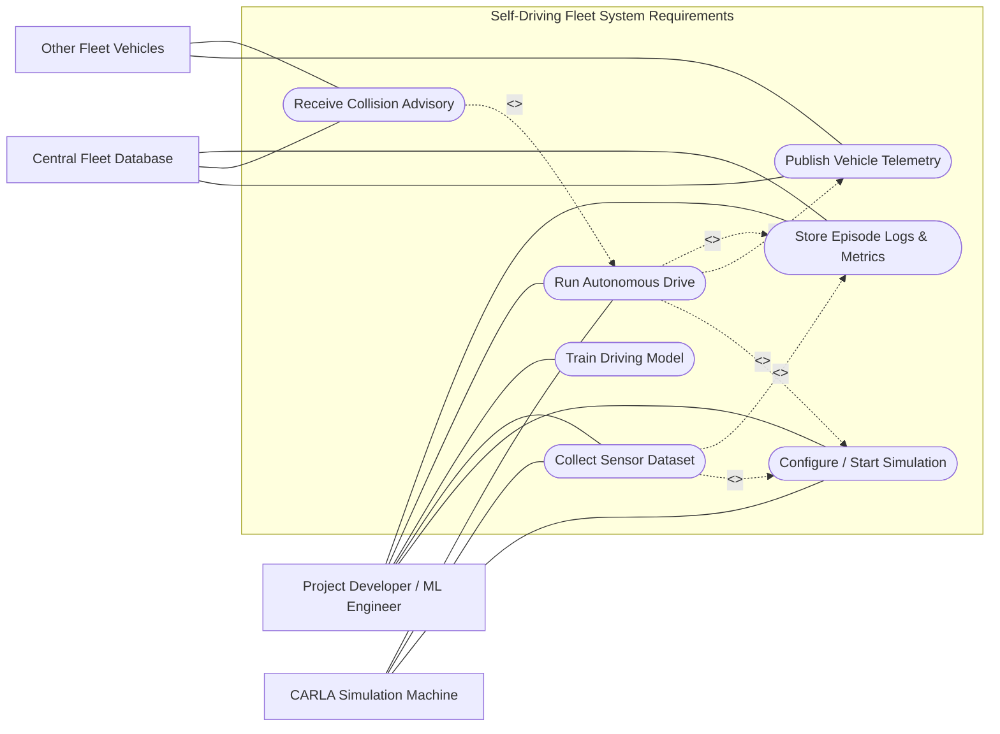

# Self-Driving Fleet Use Case Diagram

This mirrors the ATM project’s UML use-case style: one system boundary, a primary human actor, external systems, and key `<<include>>` / `<<extend>>` relationships.

## Actors

- `Project Developer / ML Engineer`: configures runs, records data, trains the model, and evaluates results.
- `CARLA Simulation Machine`: runs the real simulator and executes the vehicle client.
- `Central Fleet Database`: receives telemetry, stores run history, and returns collision advisories.
- `Other Fleet Vehicles`: publish their own state and indirectly influence collision advisories.

## Use Cases

- `Configure / Start Simulation`: choose backend, vehicle, sensors, and begin a run.
- `Collect Sensor Dataset`: record camera/state/control data for later training.
- `Train Driving Model`: train the behavior-cloning model from recorded episodes.
- `Run Autonomous Drive`: execute the trained controller in closed loop.
- `Publish Vehicle Telemetry`: send vehicle position, speed, heading, and predicted path.
- `Receive Collision Advisory`: consume warnings generated from shared fleet telemetry.
- `Store Episode Logs & Metrics`: save manifests, images, checkpoints, and coordination records.

## Mapping To This Repo

- `Configure / Start Simulation`: [main.py](/Users/dylanweaver/Documents/Projects/Carla_Self_Driving/main.py:26)
- `Collect Sensor Dataset`: [self_driving/data/recording.py](/Users/dylanweaver/Documents/Projects/Carla_Self_Driving/self_driving/data/recording.py:16)
- `Train Driving Model`: [self_driving/training.py](/Users/dylanweaver/Documents/Projects/Carla_Self_Driving/self_driving/training.py:15)
- `Run Autonomous Drive`: [self_driving/inference.py](/Users/dylanweaver/Documents/Projects/Carla_Self_Driving/self_driving/inference.py:12)
- `Publish Vehicle Telemetry`: [self_driving/networking/client.py](/Users/dylanweaver/Documents/Projects/Carla_Self_Driving/self_driving/networking/client.py:10)
- `Receive Collision Advisory`: [self_driving/networking/server.py](/Users/dylanweaver/Documents/Projects/Carla_Self_Driving/self_driving/networking/server.py:18)
- `Store Episode Logs & Metrics`: [self_driving/pipeline.py](/Users/dylanweaver/Documents/Projects/Carla_Self_Driving/self_driving/pipeline.py:13)
